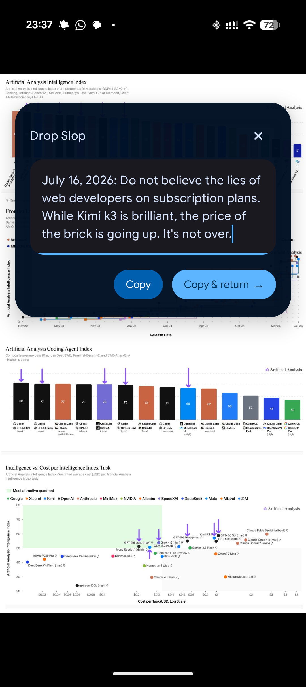

# SlopStack

The most seamless, elegant way to capture an ephemeral thought and get straight
back to what you were doing. An idea strikes — mid-video, mid-scroll,
whenever — you double-tap the back of your Pixel, speak or type it into a sleek box, tap
**Copy & return** to go right back to your activity. Paste it wherever it actually belongs once you're ready.
No app switch feels this light.



Voice is the star: any voice-to-text keyboard (Wispr Flow, Gboard voice
typing, etc.) works here, because SlopStack is just a normal, focused Android
text field — dictation engines already know how to type into that. SlopStack
doesn't care what you paste into either; a terminal, a chat, a note, a task
tracker, an email draft. It's a place to
push your unrefined slop of a thought, and pop it back out the moment you need
it. SlopStack also retains the one most recently copied drop in its private
on-device storage, so it can be restored after Gboard's clipboard history
expires; copying a newer drop replaces it.

The project is a single Android application module. Product intent, design
constraints, and durable rationale live in [`context/`](context/) (see
`context/DECISIONS.md` and `context/MAP.md`).

## Intended use

1. Double-tap into SlopStack using the Quick Tap feature in Pixels or other shortcuts from OEMs like Moto, or from the Quick Settings **Drop Slop** tile
2. Dictate or type your thought in the popup.
3. Tap **Copy & return** to go straight back to what you were doing, with the
   text sitting on the clipboard.
4. Paste it later, anywhere you want. If the clipboard expires before then,
   reopen SlopStack and tap **Restore last copy** to load its one retained drop
   back into the editor.

## Build

Install Android SDK Platform 37 (`platforms;android-37.0`) and build-tools 37.0.0,
and use JDK 21 (Gradle 9.5, AGP 9.3, and the Material 3 Expressive dependencies
require it; app bytecode still targets Java 17). From a machine with Gradle
available:

```sh
gradle :app:assembleDebug
gradle :app:installDebug
```

A Gradle wrapper is checked in; `./gradlew` works the same way once
`local.properties` points `sdk.dir` at an SDK containing Platform 37.

Add the resulting **Drop Slop** tile through Android's Quick Settings editor.

## Getting an APK without building locally

Two GitHub Actions workflows build APKs so you don't need a local Android
toolchain on every machine:

- **Every push to `main`** builds an unsigned debug APK and attaches it as a
  workflow artifact (see the Actions tab → latest "Debug build" run →
  Artifacts). Good for pulling a fresh build onto another device without
  compiling anything yourself.
- **Pushing a version tag** (`git tag v1.0.0 && git push origin v1.0.0`) builds
  a signed release APK and publishes it to the repo's Releases page. That APK
  is signed with the project's dedicated release key, so it can be installed
  and later upgraded in place across devices (unlike the debug artifact, which
  reinstalls fresh each time). Download it directly from a phone browser and
  allow "install unknown apps" for that browser to sideload it.

The release signing key lives only as GitHub Actions secrets
(`RELEASE_KEYSTORE_BASE64`, `RELEASE_STORE_PASSWORD`, `RELEASE_KEY_ALIAS`,
`RELEASE_KEY_PASSWORD`) plus one local backup copy kept outside this repo. See
`context/DECISIONS.md` for the rationale.

## Documentation checks

```sh
npm install
npm run lint:md
npm run format:md
```

Project navigation and durable design context live in [`AGENTS.md`](AGENTS.md)
and [`context/`](context/).
