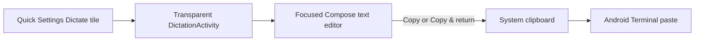

# Project Map

This repository contains a single-module Android companion for opening a
dictation field over Android Terminal.

## Layout

```text
app/
├── src/main/        Manifest, tile service, popup activity, clipboard, Compose UI
├── src/test/        Unit tests for clipboard command selection
└── src/androidTest/ Compose interaction and state-restoration tests
context/             Agent-maintained project context
gradle/              Version catalog
```

## Intended data flow



The app has no launcher screen, persistence layer, network service, or terminal
integration. Its system entry point is the Quick Settings tile; the clipboard is
the only handoff boundary.
