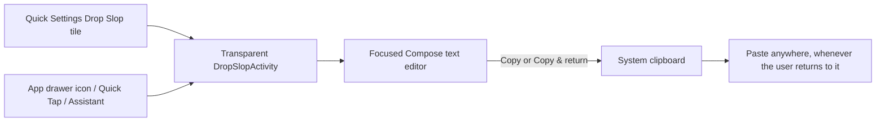

# Project Map

This repository contains SlopStack, a single-module Android app for capturing an
ephemeral dictated/typed thought and handing it back to the clipboard so the
user can paste it into whatever they were doing — a terminal, a note, a chat,
anything with a paste target.

## Layout

```text
app/
├── src/main/        Manifest, tile service, popup activity, clipboard, Compose UI
│   └── res/font/    Bundled Google Sans Flex (offline, no downloadable-fonts API)
├── src/test/        Unit tests for clipboard command selection
└── src/androidTest/ Compose interaction and state-restoration tests
context/             Agent-maintained project context
gradle/              Version catalog (material3 pinned to a 1.5.0-alpha for M3 Expressive)
licenses/            Third-party font license notices
```

## Intended data flow



The app has no persistence layer, network service, or integration with any
specific destination app.
`DropSlopActivity` is reachable from the Quick Settings tile (the original,
primary entry point) and, since a `MAIN`/`LAUNCHER` intent-filter was added for
Quick Tap/Assistant support, also from the app drawer — both paths open the
same transient popup. The clipboard is the only handoff boundary.
